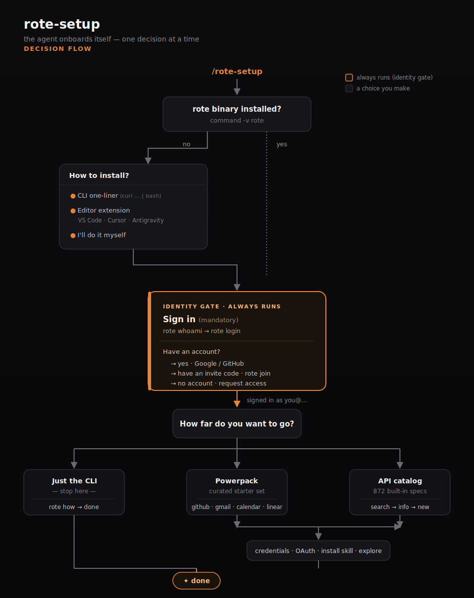

# rote-skills

Distributable [Claude Code](https://claude.com/claude-code) skills for [rote](https://getrote.dev).

## Install

This repo is a **dual-format marketplace** — the same repo installs into both Claude Code
and Codex (the `SKILL.md` is shared; each agent reads its own manifest).

### Claude Code

```bash
claude plugin marketplace add modiqo/rote-skills
claude plugin install rote-setup@rote-skills
```

Or one line: `claude plugin marketplace add modiqo/rote-skills && claude plugin install rote-setup@rote-skills`

Then run it:

```
/rote-setup
```

Installed at **user scope** by default (available in every project). Use `--scope project` to
scope it to one repo.

### Codex

```bash
codex plugin marketplace add modiqo/rote-skills
```

Then, inside a Codex session, open the **`/plugins`** browser, find **rote Setup Wizard**,
and install it. (Codex installs plugins through the in-session browser rather than a CLI
install command.) Once installed, invoke the skill with:

```
$rote-setup
```

> **Invocation differs by agent:** Claude Code uses the slash command **`/rote-setup`**;
> Codex uses the skill syntax **`$rote-setup`** (Codex skills are invoked with `$`, not `/`).

## What the wizard does

A guided, interactive wizard that takes you from zero to a working rote install:

1. **Installs rote if missing** — CLI one-liner (`curl -fsSL https://getrote.dev/install | bash`)
   or a VS Code-family editor extension (VS Code Marketplace / Open VSX for Cursor &
   Antigravity), detecting which editors you actually have.
2. **Signs you in** — every experience is identity-gated, so sign-in always runs (Google or
   GitHub; branches to request-an-invite / claim-an-invite-code if you don't have an account).
3. **Forks on how far to go** — stop at just the CLI, pull curated **powerpack** adapters,
   or **build adapters from the 872-API built-in catalog** (`rote adapter catalog search` →
   `rote adapter new`). All branches run under your signed-in identity.
4. **Menu-driven setup** — install adapters à la carte from the live registry (with their
   flows), wire credentials, connect Google OAuth, install the agent skill, and explore —
   you pick what runs.
5. **Value-proof closer** — ends by running one live flow against your own data (you pick
   it, the wizard reads its parameters and asks you for values), so setup finishes with real
   output, not just "complete."

Every branch is a clear choice; it never silently runs the whole one-liner.

## Decision flow

<p align="center">
  
</p>

The flow is **identity-gated** (sign-in always runs) and **choice-driven** at every fork —
the wizard pauses for an `AskUserQuestion` at each branch and never runs the whole setup
silently. **Just the CLI** exits clean; **Powerpack** and **API catalog** both continue on
to credentials, the agent-skill install, and a live-flow finale.

## Updating

**Claude Code:**

```bash
claude plugin update rote-setup@rote-skills
```

**Codex:** refresh the marketplace snapshot, then reinstall from the `/plugins` browser:

```bash
codex plugin marketplace upgrade rote-skills
```

## Skills in this marketplace

| Skill | Claude Code | Codex | Description |
|---|---|---|---|
| `rote-setup` | `/rote-setup` | `$rote-setup` | Guided first-run setup for rote |

## License

MIT
